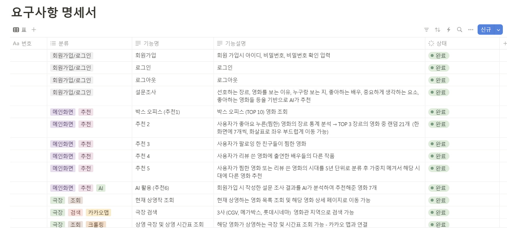
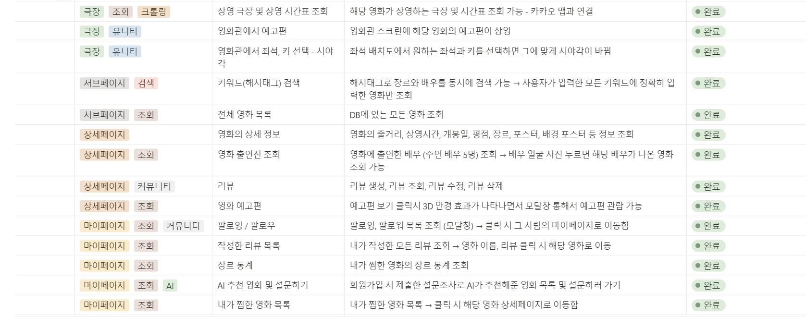
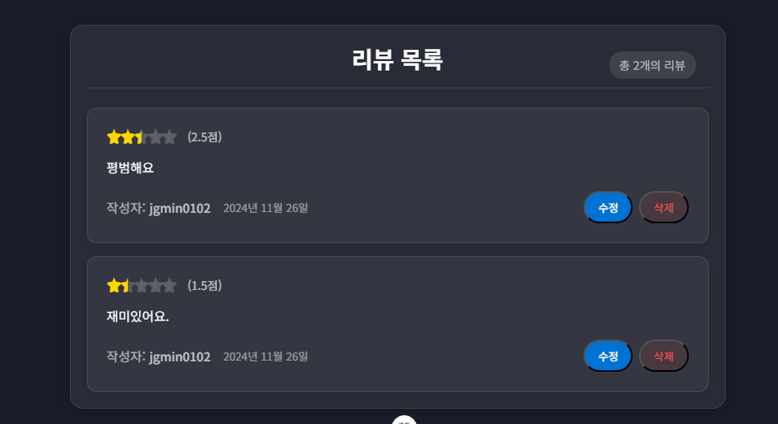
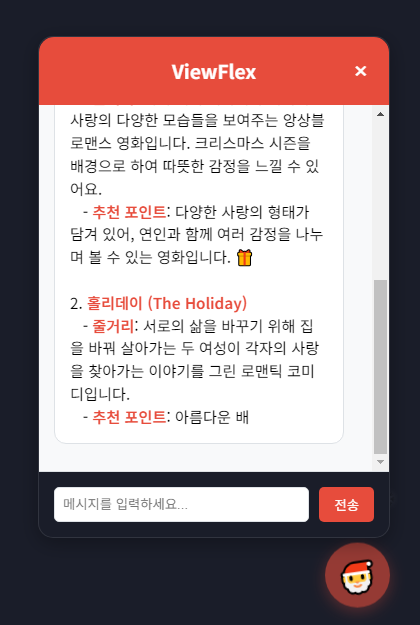
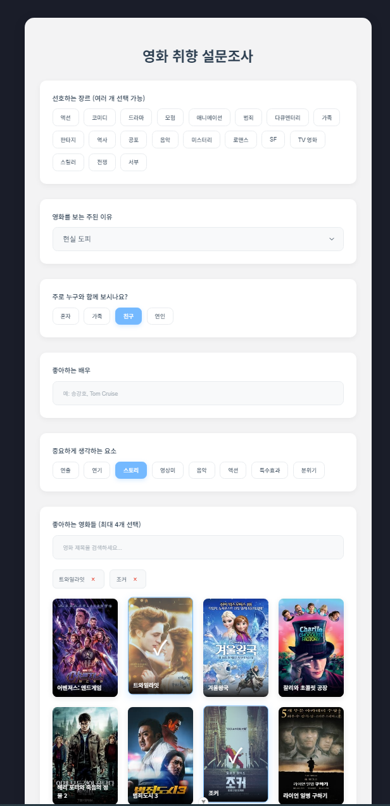

# SSAFY 관통PJT

## 1. 팀원 정보 및 업무 분담 내역
- 프로젝트 기간 : 2024.11.18 (월) ~ 2024.11.26 (화) 

- 업무 분담
    
    - 권정민 (팀장) : Django/Vue 배포, 카카오 맵 API 연동, 영화 추천 페이지 최적화(스켈레톤 로딩, 무한 스크롤, 페이지네이션), 극장 페이지 구현, nav바 구현, 마이페이지 구현, 전체 페이지 디자인 및 애니메이션 효과, TMDB API 연동(영화 데이터 & 데이터 품질 향상), 극장 위도/경도 데이터 크롤링, 유튜브 예고편 보기 구현, 모달창 구현, 영화 상영 시간표 데이터 카카오 맵 지도와 실시간 통신 구현, Unity 영화관 모델링(포스트 프로세싱으로 그래픽 향상, 조명 효과) & 예고편 재생, Unity와 Vue 양방향 통신 구현

    - 제갈민 (팀원) : 영화 추천 알고리즘 구현, 3사 영화관 상영시간표 및 상영관 크롤링, 해시태그(tagify) 및 배우 및 영화제목 검색 기능 구현, 리뷰 CRUD, 회원가입, 영화 좋아요, 팔로로우 등 기본적인 기능 구현, 장르 통계 차트 구현(chart.js), AI 챗봇 구현, 설문조사 페이지 구현, 설문조사한 결과를 gpt에 연동하여 추천 결과 페이지 구현 및 해당 결과를 마이페이지와 메인 화면에 반영, 마이페이지 구현


## 2. 목표 서비스 구현 및 실제 구현 정도



## 3. 데이터베이스 모델링 (ERD)
### 데이터베이스 모델링 (ERD)


## 4. 영화 추천 알고리즘에 대한 기술적 설명
- 한 화면에 7개씩, 화살표로 좌우 부드럽게 이동 가능
- 로그인 되지 않은 사용자 -> vote_average 순으로 영화 추천 (중복되지 않게)
- 로그인 된 사용자 -> 여러 맞춤형 추천 알고리즘 적용 (현재 상영작 중 10% 비율로 포함)

> ## 1. 사용자가 좋아요 누른(찜 한) 영화의 장르 통계 분석 
### → TOP 3 장르의 영화 중 랜덤 21개

```
@api_view(['GET'])
@permission_classes([AllowAny])
def recommended_with_genre(request):
    # 로그인 되지 않은 사용자 -> vote_average 순으로 영화 추천 (중복되지 않게)
    if not request.user.is_authenticated:
        # 첫 번째 그룹 (0-6) 섞기
        top_movies = list(Movie.objects.order_by('-vote_average')[:28])
        random.shuffle(top_movies[0:7])
        serializer = MovieSerializer(top_movies[0:7], many=True)
        return Response(serializer.data)
    user = request.user
    liked_movies = user.like_movies.all()

    # 찜한 영화가 없으면 랜덤 추천
    if not liked_movies:
        random_movies = Movie.objects.order_by('?')[:21]
        serializer = MovieSerializer(random_movies, many=True)
        return Response(serializer.data)
    
    # 사용자가 좋아요한 영화들의 장르 카운팅
    genre_counter = Counter()
    for movie in liked_movies:
        genres = movie.genre_ids.all()
        genre_counter.update([genre.name for genre in genres])
    
    # 상위 3개 장르 선택
    top_genres = [genre for genre, _ in genre_counter.most_common(3)]
    
    # 현재 상영작 먼저 선택 (중복 제거)
    playing_movies = set()
    for genre in top_genres:
        playing_movie = Movie.objects.filter(
            genre_ids__name=genre, 
            is_playing=True
        ).distinct().order_by('-vote_average').first()
        
        if playing_movie:
            playing_movies.add(playing_movie)
    
    # 남은 영화 수 계산 (21 - 현재 상영작 수)
    remaining_count = 21 - len(playing_movies)
    movies_per_genre = remaining_count // len(top_genres)
    extra_movies = remaining_count % len(top_genres)
    
    # 장르별로 영화 수집 (중복 제거)
    recommended_movies = list(playing_movies)
    seen_movies = {movie.id for movie in playing_movies}
    
    for i, genre in enumerate(top_genres):
        # 이 장르에서 가져올 영화 수
        movies_to_get = movies_per_genre + (1 if i < extra_movies else 0)
        
        # 해당 장르의 영화 가져오기 (현재 상영작 제외)
        genre_movies = Movie.objects.filter(
            genre_ids__name=genre,
            is_playing=False
        ).exclude(
            id__in=seen_movies
        ).distinct().order_by('-vote_average')
        
        # 필요한 만큼만 가져오기
        for movie in genre_movies:
            if len(recommended_movies) >= 21:
                break
            if movie.id not in seen_movies:
                recommended_movies.append(movie)
                seen_movies.add(movie.id)
                movies_to_get -= 1
                if movies_to_get <= 0:
                    break
    
    # 혹시 21개가 안 되면 다른 장르에서 추가
    if len(recommended_movies) < 21:
        additional_movies = Movie.objects.exclude(
            id__in=seen_movies
        ).order_by('?')[:21-len(recommended_movies)]
        recommended_movies.extend(additional_movies)
    
    serializer = MovieSerializer(recommended_movies, many=True)
    
    return Response({
        'top_genres': top_genres,
        'movies': serializer.data
    })
```

> ## 2. 사용자가 팔로잉 한 친구들이 찜한 영화
```
@api_view(['GET'])
@permission_classes([AllowAny])
def recommended_with_following(request):
    if not request.user.is_authenticated:
        # 두 번째 그룹 (7-13) 섞기
        top_movies = list(Movie.objects.order_by('-vote_average')[:28])
        random.shuffle(top_movies[7:14])
        serializer = MovieSerializer(top_movies[7:14], many=True)
        return Response(serializer.data)
    user = request.user
    following_users = user.followings.all()

    # 팔로잉하는 유저가 없으면 랜덤 추천
    if not following_users:
        # 현재 상영작 3개
        playing_movies = list(Movie.objects.filter(is_playing=True).order_by('?')[:3])
        # 나머지 18개 (현재 상영작 제외)
        other_movies = list(Movie.objects.filter(
            is_playing=False
        ).exclude(
            id__in=[movie.id for movie in playing_movies]
        ).order_by('?')[:18])
        recommended_movies = playing_movies + other_movies
        serializer = MovieSerializer(recommended_movies, many=True)
        return Response(serializer.data)

    # 팔로잉하는 유저들이 좋아요한 영화들 수집 (중복 제거)
    following_liked_movies = Movie.objects.filter(
        like_users__in=following_users
    ).distinct()

    # 현재 상영작 중에서 팔로잉하는 유저들이 좋아요한 영화 먼저 선택
    playing_movies = list(following_liked_movies.filter(
        is_playing=True
    ).order_by('-vote_average', '?')[:3])

    # 3개가 안되면 다른 현재 상영작로 채우기 (중복 제거)
    if len(playing_movies) < 3:
        additional_playing = Movie.objects.filter(
            is_playing=True
        ).exclude(
            id__in=[movie.id for movie in playing_movies]
        ).order_by('?')[:3-len(playing_movies)]
        playing_movies.extend(additional_playing)

    # 이미 선택된 영화 ID 집합
    selected_ids = {movie.id for movie in playing_movies}

    # 팔로잉 유저가 좋아요한 영화 중 남은 영화 선택 (현재 상영작과 중복 제외)
    remaining_count = 21 - len(playing_movies)
    remaining_following_movies = list(following_liked_movies.filter(
        is_playing=False
    ).exclude(
        id__in=selected_ids
    ).order_by('-vote_average', '?')[:remaining_count])

    # 필요한 만큼만 선택하고 ID 추가
    recommended_movies = playing_movies
    for movie in remaining_following_movies:
        if movie.id not in selected_ids:
            recommended_movies.append(movie)
            selected_ids.add(movie.id)

    # 21개가 안되면 다른 영화로 채우기 (모든 이전 선택 제외)
    if len(recommended_movies) < 21:
        additional_movies = Movie.objects.filter(
            is_playing=False
        ).exclude(
            id__in=selected_ids
        ).order_by('?')[:21-len(recommended_movies)]
        recommended_movies.extend(additional_movies)

    # 최종적으로 21개만 선택
    recommended_movies = recommended_movies[:21]

    # 결과 반환
    serializer = MovieSerializer(recommended_movies, many=True)
    return Response(serializer.data)
```

> ## 3. 사용자가 리뷰 쓴 영화에 출연한 배우들의 다른 작품
```
@api_view(['GET'])
@permission_classes([AllowAny])
def recommended_with_reviewed_actors(request):
    if not request.user.is_authenticated:
        # 세 번째 그룹 (14-20) 섞기
        top_movies = list(Movie.objects.order_by('-vote_average')[:28])
        random.shuffle(top_movies[14:21])
        serializer = MovieSerializer(top_movies[14:21], many=True)
        return Response(serializer.data)

    # 사용자가 리뷰한 영화들 가져오기
    user_reviews = Review.objects.filter(user=request.user).select_related('movie')
    reviewed_movie_ids = set(review.movie.id for review in user_reviews)
    
    # 배우 목록 수집
    actors_set = set()
    for review in user_reviews:
        movie = review.movie
        if movie.actors:
            for actor in movie.actors[:3]:
                actors_set.add(actor['name'])
    
    if not actors_set:
        # 배우 정보가 없는 경우 랜덤 추천
        playing_movies = list(Movie.objects.filter(
            is_playing=True
        ).exclude(
            id__in=reviewed_movie_ids
        ).order_by('?')[:3])
        
        other_movies = list(Movie.objects.filter(
            is_playing=False
        ).exclude(
            id__in=reviewed_movie_ids
        ).order_by('?')[:18])
        
        recommended_movies = playing_movies + other_movies
        serializer = MovieSerializer(recommended_movies, many=True)
        return Response(serializer.data)
    
    # 재 상영작 중에서 배우가 출연한 영화 찾기
    playing_recommended = []
    all_playing_movies = Movie.objects.filter(is_playing=True).exclude(id__in=reviewed_movie_ids)
    
    for movie in all_playing_movies:
        if movie.actors:
            movie_actors = {actor['name'] for actor in movie.actors[:3]}
            if actors_set & movie_actors:  # 교집합이 있는 경우
                playing_recommended.append(movie)
    
    # 상영작이 3개 미만인 경우 다른 상영작으로 채우기
    if len(playing_recommended) < 3:
        existing_ids = {m.id for m in playing_recommended}
        additional_playing = list(Movie.objects.filter(
            is_playing=True
        ).exclude(
            id__in=reviewed_movie_ids | existing_ids
        ).order_by('?')[:3-len(playing_recommended)])
        playing_recommended.extend(additional_playing)
    
    # 비상영작 중에서 배우가 출연한 영화 찾기
    other_recommended = []
    all_other_movies = Movie.objects.filter(
        is_playing=False
    ).exclude(
        id__in=reviewed_movie_ids
    )
    
    for movie in all_other_movies:
        if movie.actors:
            movie_actors = {actor['name'] for actor in movie.actors[:3]}
            if actors_set & movie_actors:  # 교집합이 있는 경우
                other_recommended.append(movie)
    
    # 최종 추천 목록 만들기
    playing_recommended = playing_recommended[:3]  # 상영작 3개
    
    # 비상영작 처리
    if len(other_recommended) > 18:
        other_recommended = random.sample(other_recommended, 18)
    elif len(other_recommended) < 18:
        existing_ids = {m.id for m in other_recommended} | {m.id for m in playing_recommended}
        additional_movies = list(Movie.objects.filter(
            is_playing=False
        ).exclude(
            id__in=reviewed_movie_ids | existing_ids
        ).order_by('?')[:18-len(other_recommended)])
        other_recommended.extend(additional_movies)
    
    # 최종 추천 목록 합치기
    recommended_movies = playing_recommended + other_recommended
    
    serializer = MovieSerializer(recommended_movies, many=True)
    return Response(serializer.data)
```

> ## 4. 사용자가 찜한 영화 또는 리뷰 쓴 영화의 개봉년도를 5년 단위로 분류 후 가중치 메겨서 해당 년도에 개봉한 영화 추천
```
@api_view(['GET'])
@permission_classes([AllowAny])
def recommended_with_release_date(request):
    if not request.user.is_authenticated:
        # 네 번째 그룹 (21-27) 섞기
        top_movies = list(Movie.objects.order_by('-vote_average')[:28])
        random.shuffle(top_movies[21:28])
        serializer = MovieSerializer(top_movies[21:28], many=True)
        return Response(serializer.data)

    # 사용자가 좋아요한 영화들의 개봉 연도 수집
    liked_movies = request.user.like_movies.all()
    reviewed_movies = Review.objects.filter(user=request.user).select_related('movie')
    
    # 이미 본 영화 ID 목록
    watched_movie_ids = set(movie.id for movie in liked_movies) | \
                       set(review.movie.id for review in reviewed_movies)
    
    recommended_movies = []
    
    # 좋아요나 리뷰가 없는 경우, 다양한 연도의 영화 추천
    if not liked_movies.exists() and not reviewed_movies.exists():
        current_year = datetime.now().year
        
        # 5개 구간으로 나누어 추천
        for i in range(5):
            period_start = current_year - (i * 10) - 10
            period_end = current_year - (i * 10)
            
            period_movies = Movie.objects.filter(
                release_date__year__range=(period_start, period_end)
            ).order_by('?')[:5]
            
            recommended_movies.extend(period_movies)
    else:
        # 연도별 선호도 계산 및 기존 로직 실행
        year_preferences = {}
        
        for movie in liked_movies:
            year = str(movie.release_date.year)
            year_preferences[year] = year_preferences.get(year, 0) + 1
        
        for review in reviewed_movies:
            year = str(review.movie.release_date.year)
            weight = 1.5 if review.rating >= 7 else 1
            year_preferences[year] = year_preferences.get(year, 0) + weight
        
        if year_preferences:
            favorite_years = sorted(
                year_preferences.items(), 
                key=lambda x: x[1], 
                reverse=True
            )[:3]
            
            favorite_years = [int(year) for year, _ in favorite_years]
            
            for base_year in favorite_years:
                period_start = (base_year // 5) * 5
                period_end = period_start + 4
                
                year_movies = Movie.objects.filter(
                    release_date__year__range=(period_start, period_end)
                ).exclude(
                    id__in=watched_movie_ids
                ).order_by('?')[:7]
                
                recommended_movies.extend(year_movies)
    
    # 무조건 21개 채우기
    if len(recommended_movies) < 21:
        existing_ids = set(movie.id for movie in recommended_movies)
        additional_count = 21 - len(recommended_movies)
        
        # 남은 모든 영화 중에서 랜덤으로 선택
        additional_movies = Movie.objects.exclude(
            id__in=existing_ids | watched_movie_ids
        ).order_by('?')[:additional_count]
        
        # 그래도 부족하다면 이미 본 영화도 포함하여 선택
        if len(additional_movies) + len(recommended_movies) < 21:
            more_movies = Movie.objects.exclude(
                id__in=existing_ids
            ).order_by('?')[:21-len(recommended_movies)-len(additional_movies)]
            additional_movies = list(additional_movies) + list(more_movies)
        
        recommended_movies.extend(additional_movies)
    
    # 정확히 21개로 제한
    recommended_movies = recommended_movies[:21]
    
    serializer = MovieSerializer(recommended_movies, many=True)
    return Response(serializer.data)
    
```

> ## 5. 회원가입 시 작성한 설문 조사 결과를 AI가 분석하여 추천해준 영화 7개
```
@api_view(['GET'])
@permission_classes([IsAuthenticated])
def get_recommendations(request):
    try:
        survey = Survey.objects.get(user=request.user)
        
        # 데이터베이스에서 영화 목록 가져오기
        all_movies = Movie.objects.all()
        
        # 사용자가 선호하는 장르의 영화들 필터링
        preferred_genres = survey.preferred_genres.split(',')
        genre_movies = Movie.objects.filter(genre_ids__name__in=preferred_genres).distinct()

        # 영화 정보를 포함한 문자열 생성
        movie_info_list = []
        for movie in genre_movies[:20]:  # 상위 20개 영화만 사용
            genres = ', '.join([genre.name for genre in movie.genre_ids.all()])
            movie_info = f"{movie.title} (장르: {genres})"
            movie_info_list.append(movie_info)

        # GPT 프롬프트 수정
        prompt = f"""
        다음은 사용자의 영화 취향 데이터입니다:
        
        - 선호하는 장르: {survey.preferred_genres}
        - 영화를 보는 주된 이유: {reason_mapping.get(survey.viewing_reason, survey.viewing_reason)}
        - 함께 보는 사람: {companion_mapping.get(survey.viewing_with, survey.viewing_with)}
        - 좋아하는 배우: {survey.favorite_actor}
        - 중요하게 생각하는 요소: {survey.movie_elements}
        - 좋아하는 영화들: {survey.favorite_movies}
        
        다음은 추천 가능한 영화 목록입니다:
        {' | '.join(movie_info_list)}
        
        위 영화들 중에서만 사용자의 취향을 분석하여, 구체적인 이유와 함께 7개의 영화를 추천해주세요.
        각 영화에 대해 제목과 함께 이 사용자가 좋아할 만한 이유를 자세히 설명해주세요.
        
        다음 형식으로 응답해주세요:
        
        [사용자 취향 분석]
        사용자의 전반적인 취향에 대한 분석
        
        [추천 영화]
        1. [영화 제목]
        - 추천 이유: (1-2줄 설명)
        
        (이하 동일한 형식으로 7개)
        """
        
        # GPT API 호출
        response = client.chat.completions.create(
            model="gpt-4o-mini",
            messages=[
                {"role": "system", "content": "당신은 영화 전문가입니다. 사용자의 취향을 분석하여 최적의 영화를 추천해주세요. 한국어로 응답해주세요."},
                {"role": "user", "content": prompt}
            ],
            temperature=0.7,
            max_tokens=2000
        )
        
        recommendations = response.choices[0].message.content
        
        # 응답을 더 예쁘게 포맷팅
        formatted_recommendations = {
            'analysis': '',
            'movies': []
        }
        
        # GPT 응답 파싱
        sections = recommendations.split('[추천 영화]')
        if len(sections) == 2:
            analysis = sections[0].replace('[사용자 취향 분석]', '').strip()
            formatted_recommendations['analysis'] = analysis
            
            movies_section = sections[1].strip().split('\n\n')
            for movie in movies_section:
                if movie.strip():
                    lines = movie.strip().split('\n')
                    if len(lines) >= 2:
                        title = lines[0].replace('1. ', '').replace('2. ', '').replace('3. ', '').replace('4. ', '').replace('5. ', '').replace('6. ', '').replace('7. ', '').strip()
                        reason = lines[1].replace('- 추천 이유: ', '').strip()
                        formatted_recommendations['movies'].append({
                            'title': title,
                            'reason': reason
                        })

        return Response(formatted_recommendations)

    except Survey.DoesNotExist:
        return Response(
            {'error': '설문 데이터가 없습니다. 먼저 설문을 완료해주세요.'}, 
            status=status.HTTP_404_NOT_FOUND
        )
    except Exception as e:
        return Response(
            {'error': f'추천 생성 중 오류가 발생했습니다: {str(e)}'}, 
            status=status.HTTP_500_INTERNAL_SERVER_ERROR
        )
```

## 5. 핵심 기능에 대한 설명
> 극장 개요
    해당 영화가 상영하는 극장 및 시간표 조회 가능 - 카카오 맵과 연결

> 극장 1
    현재 상영하는 영화 목록 조회 및 해당 영화 상세 페이지로 이동 가능


> 극장 2
    3사 (CGV, 메가박스, 롯데시네마)  영화관 지역으로 검색 가능


> 마이페이지 개요
    크리스마스테마, 눈오는 모션, 눈이 쌓인 애니메이션, 내가 작성한 모든 리뷰 조회, 장르 통계, AI 추천, 내가 찜한 영화 목록

> 마이페이지 1
    - 내가 작성한 모든 리뷰 조회 → 영화 이름, 리뷰 클릭 시 해당 영화로 이동
    - 내가 찜한 영화의 장르 통계 조회


> 마이페이지 2
    내가 찜한 영화


> 마이페이지 3
    회원가입 시 제출한 설문조사로 AI가 추천해준 영화 목록 및 설문하러 가기 


> 시리즈 페이지 개요
    영화 검색 및 모든 영화 조회

> 시리즈 1
    DB에 있는 모든 영화 조회


> 시리즈 2
    해시태그로 장르와 배우를 동시에 검색 가능 → 사용자가 입력한 모든 키워드에 정확히 입력한 영화만 조회


> 영화 추천 기능 개요
    한국 영화 추천, 랜덤 추천 이외의 찜한 영화 목록 조회


> 영화 추천 기능 1
    박스 오피스 (TOP 10) 영화 조회


> 영화 추천 기능 2
    사용자가 좋아요 누른(찜한) 영화의 장르 통계 분석 → TOP 3 장르의 영화 중 랜덤 21개  (한 화면에 7개씩, 화살표로 좌우 부드럽게 이동 가능)

> 영화 추천 기능 3  
    사용자가 팔로잉 한 친구들이 찜한 영화

> 영화 추천 기능 4          
    사용자가 리뷰 쓴 영화에 출연한 배우들의 다른 작품

> 영화 추천 기능 5  
    사용자가 찜한 영화 또는 리뷰 쓴 영화의 시대를 5년 단위로 분류 후 가중치 메겨서 해당 시대에 다른 영화 추천 

> 영화 추천 기능 6  
    회원가입 시 작성한 설문 조사 결과를 AI가 분석하여 추천해준 영화 7개


> 영화 상세 페이지 개요
    상단에 포스터와 영화 제목, 세부 내용으로 구성
    세부 내용 하단에 관련 장르 콘텐츠를 추천 받는 페이지와 해당 영화의 리뷰들을 확인할 수 있는 페이지를 선택하여 조회 가능

> 영화 상세 페이지 1
    - 영화의 줄거리, 상영시간, 개봉일, 평점, 장르, 포스터, 배경 포스터 등 정보 조회
    - 출연진 조회


> 영화 상세 페이지 2
    해당 영화에 대한 리뷰들을 작성 가능


> 영화 상세 페이지 3
    해당 영화에 대한 리뷰들을 조회, 수정, 삭제 가능


> AI 챗봇 개요
    AI를 활용한 크리스마스 테마의 챗봇 루돌프와 눈사람 애니메이션 효과 (프롬프트 - 크리스마스 테마로 영화 추천 받기)


> AI 챗봇
    채팅 기능


> 로그인, 회원가입
    회원 가입, 로그인 및 회원가입 기능 
    회원가입시 필요한 항목을 다 입력하지 않거나 로그인시 옳지 않은 아이디와 비밀번호를 입력하는 경우 등 잘못된 접근에 대한 에러메세지 출력
    회원가입시 설문조사 폼으로 이동 후 AI가 분석 및 영화 추천해주는 페이지로 이동


## 6. 생성형 AI를 활용한 부분
### 설문조사 기반 AI가 영화 취형 분석 및 영화 7개 추천(우리 DB에 있는 것으로)

- 프롬프트 및 코드

```
@api_view(['GET'])
@permission_classes([IsAuthenticated])
def get_recommendations(request):
    try:
        survey = Survey.objects.get(user=request.user)
        
        # 데이터베이스에서 영화 목록 가져오기
        all_movies = Movie.objects.all()
        
        # 사용자가 선호하는 장르의 영화들 필터링
        preferred_genres = survey.preferred_genres.split(',')
        genre_movies = Movie.objects.filter(genre_ids__name__in=preferred_genres).distinct()

        # 영화 정보를 포함한 문자열 생성
        movie_info_list = []
        for movie in genre_movies[:20]:  # 상위 20개 영화만 사용
            genres = ', '.join([genre.name for genre in movie.genre_ids.all()])
            movie_info = f"{movie.title} (장르: {genres})"
            movie_info_list.append(movie_info)

        # GPT 프롬프트 수정
        prompt = f"""
        다음은 사용자의 영화 취향 데이터입니다:
        
        - 선호하는 장르: {survey.preferred_genres}
        - 영화를 보는 주된 이유: {reason_mapping.get(survey.viewing_reason, survey.viewing_reason)}
        - 함께 보는 사람: {companion_mapping.get(survey.viewing_with, survey.viewing_with)}
        - 좋아하는 배우: {survey.favorite_actor}
        - 중요하게 생각하는 요소: {survey.movie_elements}
        - 좋아하는 영화들: {survey.favorite_movies}
        
        다음은 추천 가능한 영화 목록입니다:
        {' | '.join(movie_info_list)}
        
        위 영화들 중에서만 사용자의 취향을 분석하여, 구체적인 이유와 함께 7개의 영화를 추천해주세요.
        각 영화에 대해 제목과 함께 이 사용자가 좋아할 만한 이유를 자세히 설명해주세요.
        
        다음 형식으로 응답해주세요:
        
        [사용자 취향 분석]
        사용자의 전반적인 취향에 대한 분석
        
        [추천 영화]
        1. [영화 제목]
        - 추천 이유: (1-2줄 설명)
        
        (이하 동일한 형식으로 7개)
        """
        
        # GPT API 호출
        response = client.chat.completions.create(
            model="gpt-4o-mini",
            messages=[
                {"role": "system", "content": "당신은 영화 전문가입니다. 사용자의 취향을 분석하여 최적의 영화를 추천해주세요. 한국어로 응답해주세요."},
                {"role": "user", "content": prompt}
            ],
            temperature=0.7,
            max_tokens=2000
        )
        
        recommendations = response.choices[0].message.content
        
        # 응답을 더 예쁘게 포맷팅
        formatted_recommendations = {
            'analysis': '',
            'movies': []
        }
        
        # GPT 응답 파싱
        sections = recommendations.split('[추천 영화]')
        if len(sections) == 2:
            analysis = sections[0].replace('[사용자 취향 분석]', '').strip()
            formatted_recommendations['analysis'] = analysis
            
            movies_section = sections[1].strip().split('\n\n')
            for movie in movies_section:
                if movie.strip():
                    lines = movie.strip().split('\n')
                    if len(lines) >= 2:
                        title = lines[0].replace('1. ', '').replace('2. ', '').replace('3. ', '').replace('4. ', '').replace('5. ', '').replace('6. ', '').replace('7. ', '').strip()
                        reason = lines[1].replace('- 추천 이유: ', '').strip()
                        formatted_recommendations['movies'].append({
                            'title': title,
                            'reason': reason
                        })

        return Response(formatted_recommendations)

    except Survey.DoesNotExist:
        return Response(
            {'error': '설문 데이터가 없습니다. 먼저 설문을 완료해주세요.'}, 
            status=status.HTTP_404_NOT_FOUND
        )
    except Exception as e:
        return Response(
            {'error': f'추천 생성 중 오류가 발생했습니다: {str(e)}'}, 
            status=status.HTTP_500_INTERNAL_SERVER_ERROR
        )
```

### AI 챗봇 
- 크리스마스 커스텀
- 프롬프트 : 
 "당신은 크리스마스 분위기의 영화 전문가입니다. 사용자에게 크리스마스와 겨울에 어울리는 영화를 추천해주고, 영화에 대한 정보를 제공합니다. 대화할 때 이모지를 적절히 사용하여 친근한 분위기를 만듭니다."

```
const sendMessage = async () => {
  if (!userInput.value.trim()) return

  chatMessages.value.push({ 
    type: 'user', 
    text: userInput.value.trim() 
  })
  
  const userQuestion = userInput.value
  userInput.value = ''
  scrollToBottom()

  try {
    const response = await axios.post(
      'https://api.openai.com/v1/chat/completions',
      {
        model: "gpt-4o-mini",
        messages: [
          {
            role: "system",
            content: "당신은 크리스마스 분위기의 영화 전문가입니다. 사용자에게 크리스마스와 겨울에 어울리는 영화를 추천해주고, 영화에 대한 정보를 제공합니다. 대화할 때 이모지를 적절히 사용하여 친근한 분위기를 만듭니다."
          },
          {
            role: "user",
            content: userQuestion
          }
        ],
        temperature: 0.7,
        max_tokens: 200
      },
      {
        headers: {
          'Authorization': `Bearer ${import.meta.env.VITE_OPENAI_API_KEY}`,
          'Content-Type': 'application/json'
        }
      }
    )

    const botResponse = response.data.choices[0].message.content
    const formattedResponse = botResponse
      // 영화 제목 포맷팅
      .replace(/\*\*(.*?)\*\*/g, '<span class="movie-title">$1</span>')
      // 개봉연도 포맷팅
      .replace(/(\d{4})/g, '<span class="year">$1</span>')
      // 추천 포인트 포맷팅
      .replace(/(추천 포인트|줄거리|감독|출연|장르):/g, '<span class="label">$1:</span>')
      // 구분선 추가
      .split('\n').join('<br>')

    chatMessages.value.push({ 
      type: 'bot', 
      text: formattedResponse,
      html: true
    })
    scrollToBottom()
  } catch (error) {
    console.error('ChatGPT API 오류:', error)
    chatMessages.value.push({ 
      type: 'bot', 
      text: '죄송합니다. 일시적인 오류가 발생했습니다. 잠시 후 다시 시도해주세요. 🙏' 
    })
    scrollToBottom()
  }
}

```
# 7. 기타 (느낀점, 후기 등)
    권정민: 계획했던 것을 모두 하기엔 시간이 부족해서 아쉬움이 남습니다. 비록 주제가 정해진 프로젝트였지만, 개발자로서 첫 프로젝트인만큼 사람들의 불편함을 해소해줄 기능이 무엇이 있을지를 고민하다가 내가 불편한 건 다른 누군가도 불편하지 않았을까 하는 생각에 경험을 바탕으로 아이디어를 구상했습니다. 요즘은 영화관마다 좌석 배치나 시야각이 전부 달라서 해당 영화관에서는 어떤 좌석이 나에게 잘 맞는지 고르는 걸 도와주는 기능이 있다면 편리하겠다는 생각에 Unity로 영화관 체험 기능을 넣어 보고 싶어서 프로젝트 한 달 전부터 따로 공부를 해서 진행하게 되었습니다. 프로젝트를 진행하며 클린 코드의 중요성과 배포를 염두한다면 정말 신경을 많이 써야 한다는 점을 느꼈습니다. 특히, 유지보수성을 고려하지 못한 것 같아서 다음부터는 꼭 신경 써서 코딩을 해야겠다고 느꼈습니다. 그래도 좋은 팀원과 밤을 새워가며 원하는 기능을 많이 구현해봐서 후회 없이 즐겁게 마무리 했습니다.

    제갈민: 이번 프로젝트를 통해서 화면에 보여주고 싶은 데이터들을 보여주기 위해서 벡에서 serializer와 view 코드를 어떻게 구현해야 할지 깊게 고민해 볼 수 있는 시간이였습니다. 특히 프론트에서 전역 적으로 관리해야하는 데이터(ex) AI가 반환한 결과를 저장하여 여러 페이지에서 보여주기 등)를 관리하는 방법을 많이 배운것 같습니다. 팀원과 함께 기본적인 기능을 빨리 구현하고 크롤링과 같은 다른 것들도 해보면서 더 많은 것을 배우고 다른 팀보다 많은 기능을 해볼 수 있어 기억에 많이 남을 프로젝트였습니다.

## 8. 배포 서버 URL
- URL : https://beamish-kleicha-ee462c.netlify.app
- Back : pythonanywhere
- Front : netlify

장고 배포는 파이썬 애니웨어 / 뷰 배포는 넷리파이 로 진행하였습니다. 로컬 서버에서는 깊게 신경 안 쓰고 편하게 코드를 구현해도 작동이 잘 되는데, 배포 서버에서는 정말 다양한 이유로 수많은 오류가 발생했습니다. stroe에서 데이터를 불러올 때 변수 처리를 안 하고 하드 코딩으로 불러온 코드들은 배포 후에 서버가 바뀌면서 전부 다 수정해야 했고, 함수 및 초기화 순서에 따라 배포 서버에서는 오류가 발생하기도 하고, 로딩 시간 지연으로 인해 예상치 못한 오류가 발생하기도 했습니다. 따라서 유지보수를 위해 클린 코드는 필수라고 느꼈습니다.

## 9. 최적화
자료 조사 중, 최상급 성능의 서버를 가진 넷플릭스도 과부하가 안 생기도록 최적화에 신경쓰는 모습을 보고 
향후 배포를 고려하여 스켈레톤 로딩, 무한 스크롤, 페이지네이션으로 최적화를 통해 서버 부하를 감소시켰습니다.

## 10. 크롤링
### selenium, BeautifulSoup 사용
- 메가박스, 롯데시네마 상영 영화, 상영 스크린, 상영 시간표 크롤링
메가 박스 크롤링 및 원하는 형식의 JSON 파일로 저장 코드

```
from bs4 import BeautifulSoup
from selenium import webdriver
from selenium.webdriver.support.ui import WebDriverWait
from selenium.webdriver.support import expected_conditions as EC
from selenium.webdriver.common.by import By
import time
import json
from datetime import datetime

def get_movie_theaters():
    url = "https://www.megabox.co.kr/booking/timetable"
    
    options = webdriver.ChromeOptions()
    options.add_argument('--start-maximized')
    options.add_argument('--disable-gpu')
    options.add_argument('--no-sandbox')
    options.add_argument('--disable-dev-shm-usage')
    options.add_argument('--disable-blink-features=AutomationControlled')
    options.add_argument('--user-agent=Mozilla/5.0 (Windows NT 10.0; Win64; x64) AppleWebKit/537.36 (KHTML, like Gecko) Chrome/119.0.0.0 Safari/537.36')
    options.add_experimental_option('excludeSwitches', ['enable-automation'])
    options.add_experimental_option('useAutomationExtension', False)
    driver = webdriver.Chrome(options=options)
    
    try:
        driver.execute_cdp_cmd('Network.setUserAgentOverride', {"userAgent": 'Mozilla/5.0 (Windows NT 10.0; Win64; x64) AppleWebKit/537.36 (KHTML, like Gecko) Chrome/119.0.0.0 Safari/537.36'})
        driver.execute_script("Object.defineProperty(navigator, 'webdriver', {get: () => undefined})")
        
        driver.get(url)
        time.sleep(15)
        
        selectors = [
            "button[date-data='2024.11.26']",
            "button.on[date-data='2024.11.26']",
            "button[date-data='2024.11.26'].on"
        ]
        
        data_button = None
        for selector in selectors:
            try:
                data_button = WebDriverWait(driver, 5).until(
                    EC.element_to_be_clickable((By.CSS_SELECTOR, selector))
                )
                break
            except:
                continue
                
        if data_button:
            driver.execute_script("arguments[0].click();", data_button)
            time.sleep(3)
        else:
            print("날짜 버튼을 찾을 수 없습니다.")
            return
        
        # 지역 코드 이용해서 지역 탭 클릭
        # ex) 55 - 부산/경북/대구 지역 탭 클릭
        region_button = WebDriverWait(driver, 10).until(
            EC.presence_of_element_located((By.CSS_SELECTOR, "a.btn[data-area-cd='55']"))
        )
        actions = webdriver.ActionChains(driver)
        actions.move_to_element(region_button).click().perform()
        time.sleep(2)
        
        # 극장 목록 가져오기
        theater_elements = driver.find_elements(By.CSS_SELECTOR, ".theater-area-click a")
        theater_elements2 = driver.find_elements(By.CSS_SELECTOR, ".theater-type-box .theater-type .theater-name")
        
        theaters_data = []
        
        print("\n부산/대구/경상 지역 극장 목록:")
        try:
            # 각 극장별로 처리
            for i in range(len(theater_elements)):
                theater_name = theater_elements[i].text
                theater_name_detail = theater_elements2[i].text if i < len(theater_elements2) else "정보 없음"
                
                # 현재 선택된 극장의 첫 번째 상영 정보만 가져오기
                theater_time_div = driver.find_element(By.CSS_SELECTOR, ".theater-time")  # 첫 번째 요소만 선택
                
                # 영화 타입 정보 수집
                movie_type_element = theater_time_div.find_element(By.CSS_SELECTOR, ".theater-type-area")
                movie_type = movie_type_element.text # 2D, 2D ATMOS 등만 남김
                
                # 해당 타입의 상영 시간 정보 수집
                time_elements = theater_time_div.find_elements(By.CSS_SELECTOR, ".time-list-table td .time")
                showing_times = [time_element.text for time_element in time_elements]
                
                theater_data = {
                    "model": "movies.theater",
                    "pk": None,
                    "fields": {
                        "movie_id": 9999996,
                        "movie_name": "나의 히어로 아카데미아 더 무비: 유어 넥스트",
                        "chain": "메가박스",
                        "area": "대구/경북/경남/부산",
                        "theater": theater_name,
                        "screen": theater_name_detail,
                        "showing_times": showing_times,
                        "movie_type": movie_type
                    }
                }
                theaters_data.append(theater_data)
                
                print(f"극장명: {theater_name}")
                print(f"상세정보: {theater_name_detail}")
                print(f"상영타입: {movie_type}")
                print(f"상영시간: {showing_times}")
                print("-" * 30)
                
        except Exception as e:
            print(f"극장 데이터 처리 중 오류 발생: {e}")
        
        print("JSON 파일 저장 시도...")
        # 기존 JSON 파일이 있다면 읽어오기
        try:
            existing_data = []
            try:
                with open('combined_theaters.json', 'r', encoding='utf-8') as f:
                    existing_data = json.load(f)
                # 기존 데이터의 마지막 pk 값을 찾음
                last_pk = max(item['pk'] for item in existing_data) if existing_data else 0
            except FileNotFoundError:
                last_pk = 0  # 파일이 없는 경우 pk를 0부터 시작
            
            # theaters_data 생성 시 pk 수정
            for idx, theater_data in enumerate(theaters_data):
                theater_data['pk'] = last_pk + idx + 1
            
            # 새로운 데이터를 기존 데이터에 추가
            combined_data = existing_data + theaters_data
            
            # 전체 데이터를 다시 저장
            with open('combined_theaters.json', 'w', encoding='utf-8') as f:
                json.dump(combined_data, f, ensure_ascii=False, indent=2)
            print("JSON 파일 저장 완료!")
        except Exception as e:
            print(f"JSON 파일 저장 중 오류 발생: {e}")

    except Exception as e:
        print(f"전체 프로세스 에러 발생: {e}")
    finally:
        time.sleep(3)
        driver.quit()
```
# 유니티
유니티에서 유튜브 영상을 링크로 실행 시키려면 유니티 유튜브 패키지를 사용해야 합니다. 그래서 외국인 개발자의 유튜브를 참고하여 구현했는데 CROS 에러가 발생했습니다. CORS란, 웹사이트에서 유튜브 동영상이나 데이터를 직접 임베드할 때 발생하는 보안 제한입니다. 구글링을 해보니 인비디어스라는 유튜브 대체 프론트엔드를 사용하여 해결한다고 되어있었고 실제로 11월 초에 미리 해봤을 때만 해도 가능 했었는데, 모델링 구현 이후에 다시 실행하니 안 됐습니다. 알고 보니 2주 전에 유튜브가 인비디어스를 차단해서 발생한 문제였고, 지금은 유튜브 링크를 통해 유니티에서 영상을 실행하는 게 불가능하다는 것이 결론입니다. 하지만 인비디어스 측에서 해당 문제를 금방 해결할 수 있을 것이라고 했기 때문에 시간이 지나면 해결될 문제입니다. 초반 모델링 작업을 끝낸 후에는 생각보다 퀄리티가 낮아서 포스트 프로세싱으로 그래픽을 개선하였고 각종 조명 효과를 추가하여 사용자의 몰입감을 높였습니다.