<h1 align="center">ViewFlex+ : 영화 추천 및 영화관 좌석 체험 서비스</h1>

    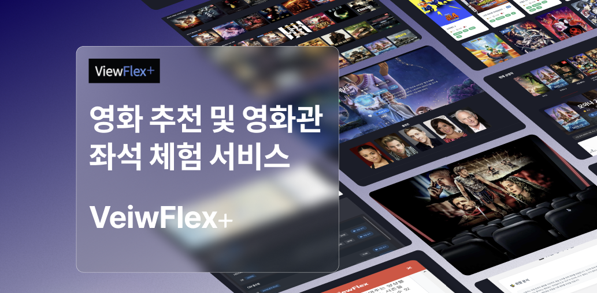

### Samsung Software Academy For Youth — 관통 프로젝트

> 2024.11.18 \~ 2024.11.26
---

## 목차

1. [시작하기](#시작하기)
2. [주요 기능](#주요-기능)
3. [서비스 화면](#서비스-화면)
4. [기술 차별점](#기술-차별점)
5. [기술 스택](#기술-스택)
6. [시스템 아키텍처](#시스템-아키텍처)
7. [ERD](#erd-entity-relationship-diagram)
8. [팀원](#팀원)

---

## 시작하기

* **서비스 URL**: [https://beamish-kleicha-ee462c.netlify.app](https://beamish-kleicha-ee462c.netlify.app)
* **배포**: Front — *Netlify*, Back — *PythonAnywhere*

---

## 주요 기능

### 1) 영화관 좌석 체험 (Unity)

* **Unity 기반 가상 체험 시스템**: 실제 영화관 좌석 환경을 3D로 구현
* 사용자가 자신의 **키·좌석 위치**를 선택하면, 실제 관람 시야각처럼 화면이 움직여 몰입도 극대화
* 영화 예고편 재생, 팝콘 같은 **3D 오브젝트 효과** 제공 → 현실감 있는 체험

### 2) 추천

* **비로그인**: vote_average 상위 28편을 7장×4섹션으로 슬라이드 노출(섹션별 셔플)
* **선호 장르 기반**: 찜한 영화의 **장르 통계 Top3** → 현재 상영작 우선 + 평점 기반으로 구성
* **팔로잉 기반**: 팔로우한 사용자의 **좋아요 목록**을 활용
* **배우 기반**: 내가 리뷰한 영화의 **주요 배우** 출연작을 추천
* **연도 기반**: 찜/리뷰 연도를 **5년 단위**로 가중치 산정 → 해당 시기 영화 추천
* **설문+AI 기반**: 가입 설문 + DB를 프롬프트로 전달, **분석 요약** 및 영화 추천

### 3) 극장/지도

* 현재 상영작 **상영 극장·시간표 조회** (3사: CGV/메가/롯데)
* **카카오맵 연동**: 극장 좌표 매핑, 지도 ↔ 타임테이블 상호작용

### 4) 검색/시리즈

* **전체 영화 조회** (페이지네이션/무한스크롤)
* **해시태그 검색(Tagify)**: 장르+배우 **교집합 필터** (정확 일치 기반)

### 5) 상세/리뷰

* 포스터/배경/줄거리/장르/평점/출연진 등 메타 정보
* 리뷰 작성/조회/수정/삭제 가능
* 관련 장르 기반 콘텐츠 추천

### 6) 마이페이지

* 내가 쓴 **모든 리뷰 모아보기** (상세 이동)
* **장르 통계 차트** (Chart.js)
* **찜한 영화 목록** 및 **AI 추천 결과**
* 시즌 테마: **크리스마스 눈/적설 애니메이션**

### 7) UI/UX

* **유튜브 예고편** 보기
* **모달/스켈레톤/애니메이션** 전반 적용, **NavBar/디자인 일관성**

---

## 서비스 화면

| 극장/지도 | 시리즈 |
|-----------|--------|
| 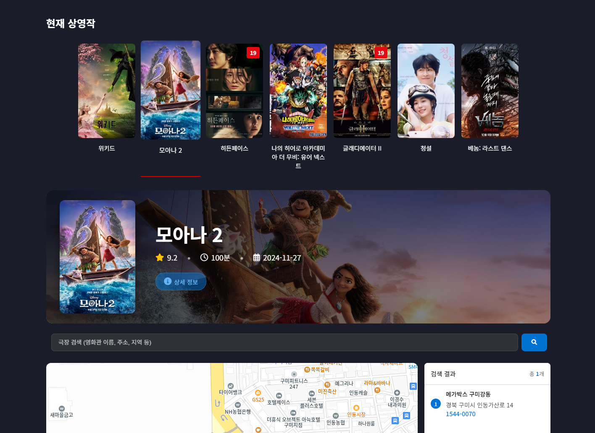 | 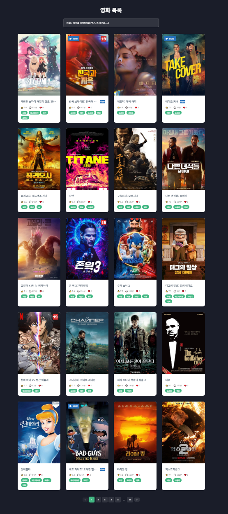 |
| 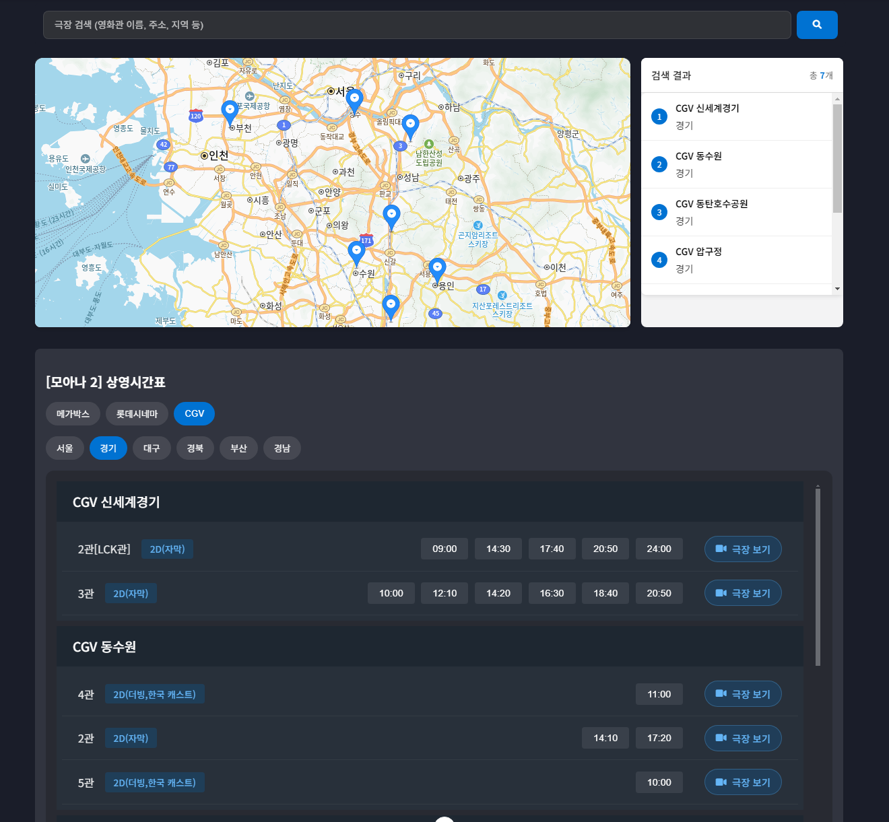 |  |

| 추천 | 마이페이지 |
|------|------------|
| 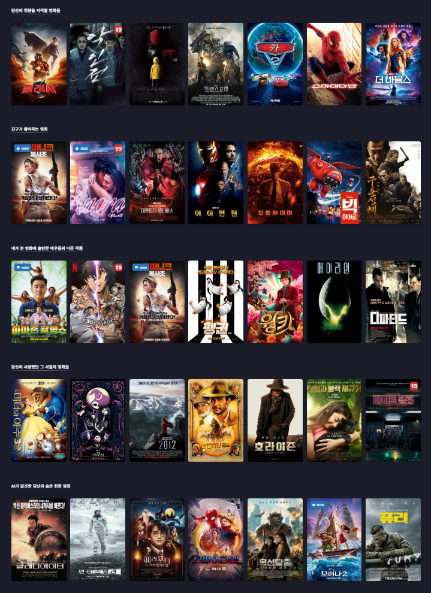 | 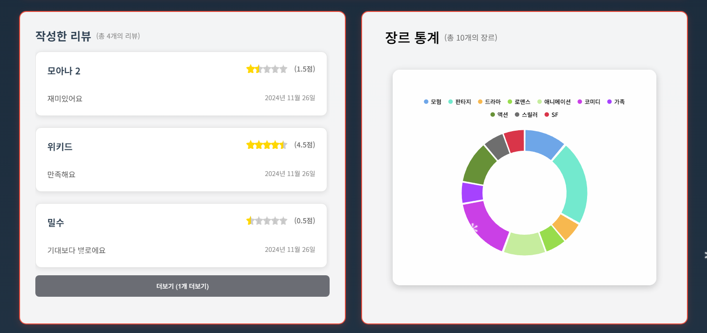 |
| 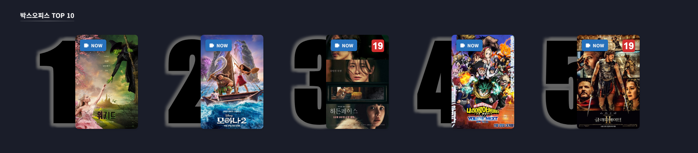 | 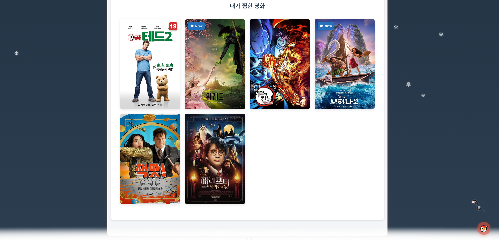 |
|      | 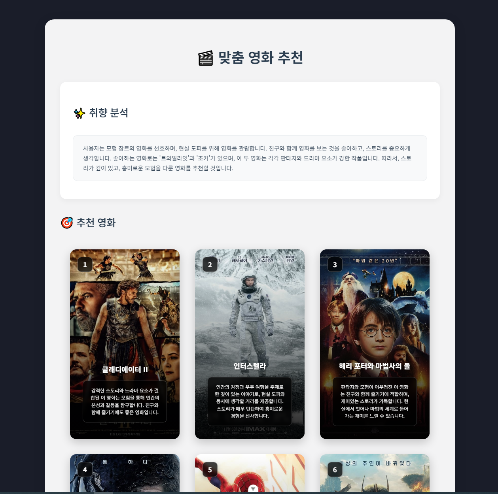 |

| 상세 페이지 |
|-------------|
| 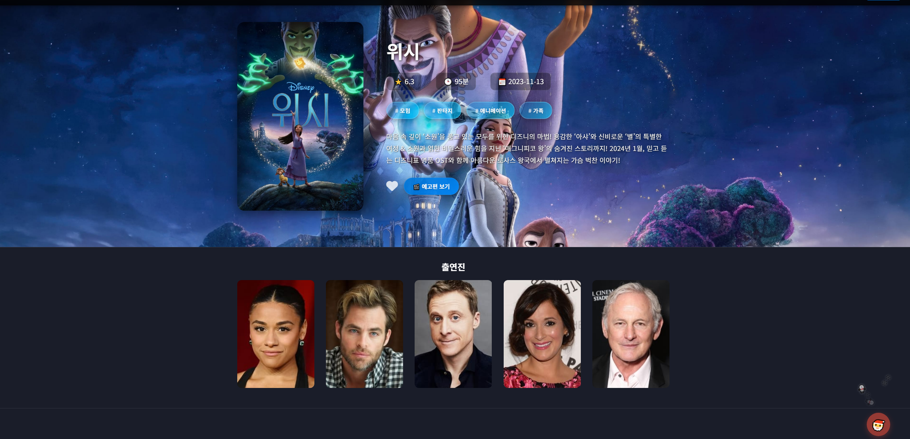 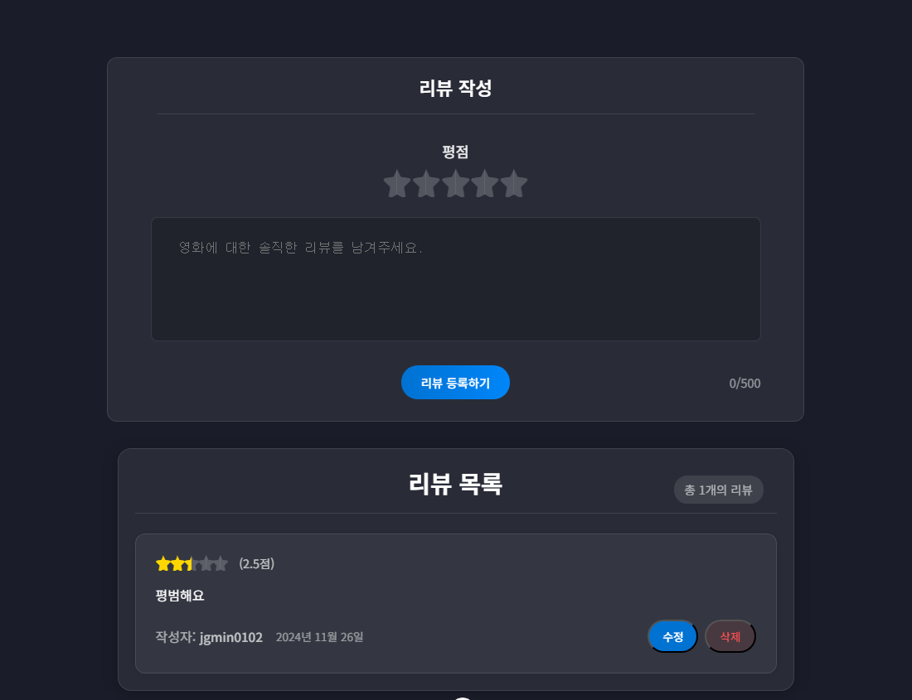 |

---

## 기술 차별점

1. **실시간 상영정보 연계**: 3사 크롤링 + 카카오맵 좌표 동기화로 탐색→방문 흐름 단축
2. **UX 성능 최적화**: 스켈레톤, 무한 스크롤, 페이지네이션으로 **초기지연·트래픽 절감**
3. **데이터 품질 보강**: TMDB + 극장 좌표/시간표 크롤링으로 메타 고도화
4. **Unity 그래픽**: 그래픽 품질 향상(포스트 프로세싱/조명)

---

## 기술 스택

**Frontend**

* Vue (SPA), JavaScript, Chart.js, Tagify
* Kakao Maps JavaScript API

**Backend**

* Django REST Framework
* TMDB API 연동(메타데이터/이미지)
* Selenium + BeautifulSoup (극장 시간표/상영관 크롤링)

**Infra**

* Netlify(프론트), PythonAnywhere(백엔드)

**ETC**

* Unity(영화관 좌석 및 시야각각 체험 — 포스트 프로세싱/조명)

---

## 시스템 아키텍처

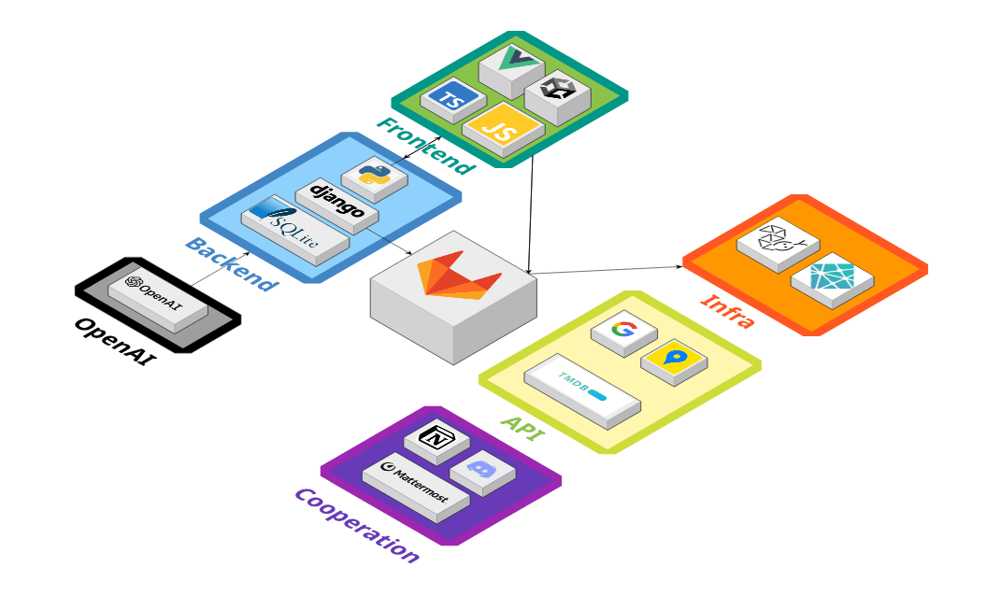

---

## ERD (Entity Relationship Diagram)

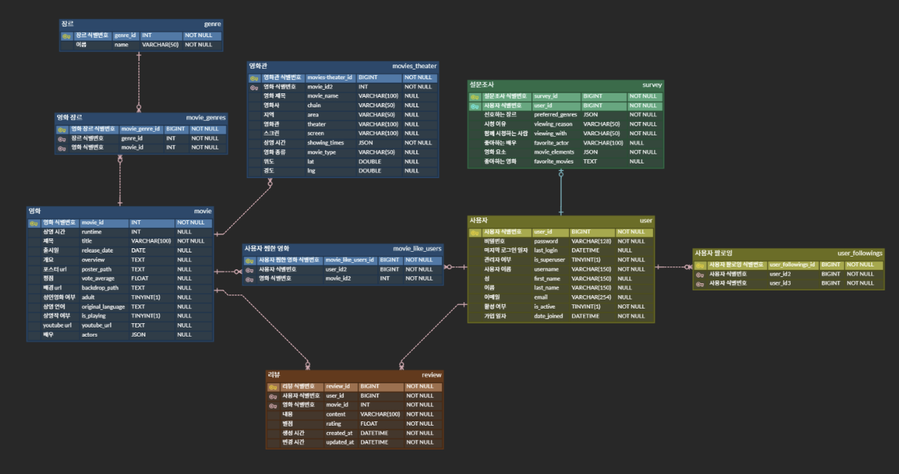

## 팀원

| **권정민 (팀장)** | **제갈민 (팀원)** |
|------------|------------|
| Infra · Unity · Full Stack | Full Stack |
